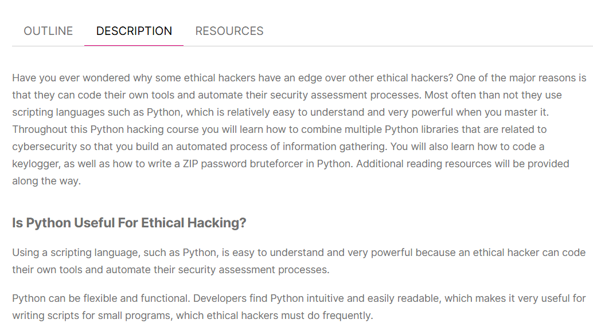
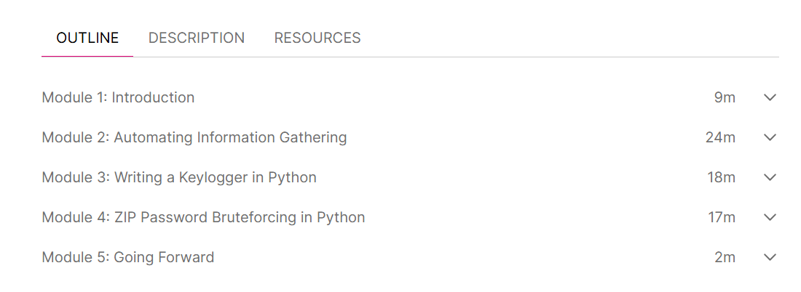
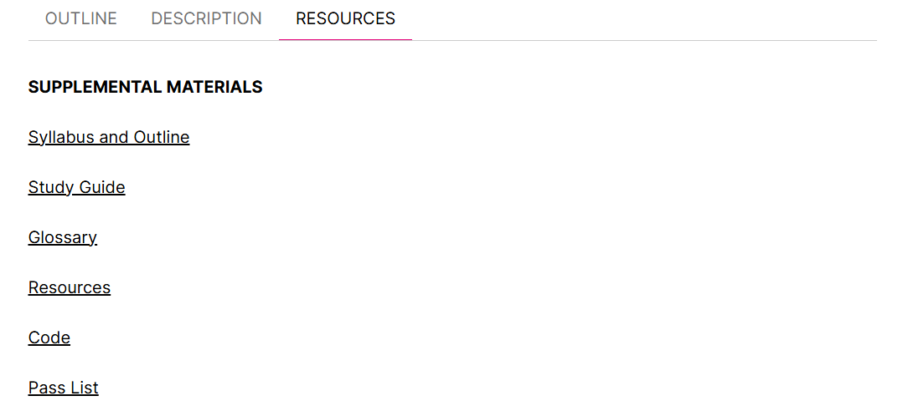

# 🛡️ Developing Ethical Hacking Tools with Python – Continue Education Completion Cybrary  

      

This repository contains **notes, labs, demos, extras, docs, and certificate** for the *Developing Ethical Hacking Tools with Python* course by Cybrary.  
The course focuses on building **custom ethical hacking tools** using Python for penetration testing, network scanning, exploitation, post-exploitation, and automation.  

---

## 📚 Notes  

- 📄 [`01-introduction.md`](./notes/01-introduction.md) – Introduction to ethical hacking tools  
- 📄 [`02-python-basics.md`](./notes/02-python-basics.md) – Python fundamentals  
- 📄 [`03-network-scanning.md`](./notes/03-network-scanning.md) – Network scanning scripts  
- 📄 [`04-exploitation-scripts.md`](./notes/04-exploitation-scripts.md) – Exploit development  
- 📄 [`05-post-exploitation.md`](./notes/05-post-exploitation.md) – Post-exploitation techniques  
- 📄 [`06-automation-tools.md`](./notes/06-automation-tools.md) – Automation scripts  
- 📄 [`07-credential-harvesting.md`](./notes/07-credential-harvesting.md) – Credential harvesting  
- 📄 [`08-reporting-ethics.md`](./notes/08-reporting-ethics.md) – Reporting & ethical guidelines  

---

## 🧪 Labs  

- 🛠️ [`lab-python-setup.md`](./labs/lab-python-setup.md) – Setting up Python & libraries  
- 🌐 [`lab-network-scanning.md`](./labs/lab-network-scanning.md) – Network scanning lab  
- ⚔️ [`lab-exploitation.md`](./labs/lab-exploitation.md) – Exploitation lab  
- 🕵️ [`lab-post-exploitation.md`](./labs/lab-post-exploitation.md) – Post-exploitation lab  
- 🤖 [`lab-automation-tools.md`](./labs/lab-automation-tools.md) – Automation scripts lab  
- 🔑 [`lab-credential-harvesting.md`](./labs/lab-credential-harvesting.md) – Credential harvesting lab  
- 📝 [`lab-reporting.md`](./labs/lab-reporting.md) – Reporting lab  

---

## 💻 Demos  

- ⚡ [`demo-network-scanner.py`](./demos/demo-network-scanner.py) – Sample TCP scanner  
- ⚡ [`demo-exploit.py`](./demos/demo-exploit.py) – Safe exploitation demo  
- ⚡ [`demo-post-exploitation.py`](./demos/demo-post-exploitation.py) – Post-exploitation demo  
- ⚡ [`demo-automation.py`](./demos/demo-automation.py) – Automation scripts demo  
- ⚡ [`demo-credential-harvesting.py`](./demos/demo-credential-harvesting.py) – Credential harvesting demo  

---

## 🔬 Extras  

- 📑 [`case-studies.md`](./extras/case-studies.md) – Practical case studies  
- 📚 [`resources.md`](./extras/resources.md) – Recommended resources & tools  
- 📆 [`timeline.md`](./extras/timeline.md) – Learning & practice milestones  

---

## 📖 Docs  

- 📘 [`glossary.md`](./docs/glossary.md) – Key terms & definitions  
- 📘 [`index.md`](./docs/index.md) – Course overview & structure  
- 📘 [`references.md`](./docs/references.md) – Bibliography & references  
- 📘 [`roadmap.md`](./docs/roadmap.md) – Learning roadmap  
- 📘 [`syllabus.md`](./docs/syllabus.md) – Course syllabus  

---

## 📸 Screenshots  

| Step                  | Screenshot |
|-----------------------|------------|
| 🏫 Course Description  |  |
| 📘 Module Overview     |  |
| 📚 Resources           |  |

---

## 📜 Certificate  

🎓 [`Cybrary – Developing Ethical Hacking Tools with Python`](./cert/cybrary-cert-developing-ethical-hacking-tools-with-python.pdf)  

---

## 📝 Personal Review  

This course helped me **reinforce Python skills** for penetration testing and ethical hacking.  
The **labs and demos** allowed hands-on practice in network scanning, exploitation, post-exploitation, automation, and credential harvesting.  
I also appreciated the **ethical considerations** module, which emphasizes responsible usage of Python tools in security testing.  

Overall, a practical and structured course for anyone wanting to **develop custom hacking tools safely using Python**.  

---

## ✍️ Author  

**Thành Danh** – Red Team Learner & Security Researcher  

- GitHub: [@ngvuthdanhh](https://github.com/ngvuthdanhh)  
- Email: ngvu.thdanh@gmail.com  

---

## 📄 License  

This project is licensed under the terms of the **MIT License**.  
See [`LICENSE`](./LICENSE) for details.  

© 2025 ngvuthdanhh. All rights reserved.
